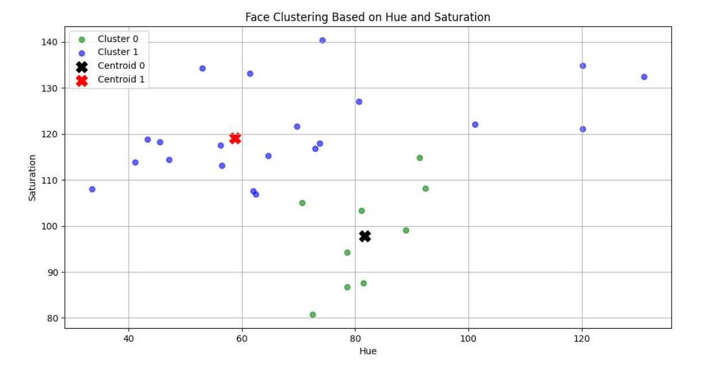

# Distance-Based Classification with K-Means & WandB Tracking
Clustering with K-Means:
The extracted hue and saturation features were used to group faces into two distinct clusters using the K-Means algorithm. The clustering results, along with their centroids, were visualized through a scatter plot, providing insights into how color-based features differentiated the faces.

Face Detection & Clustering:
The project utilized a Haar Cascade classifier for face detection. This process involved converting the image to grayscale and applying the detectMultiScale function, which accurately identified facial regions.

Feature Extraction:
Once the faces were detected, each face region was transformed from BGR/RGB to HSV color space. The mean hue and saturation values were computed for each face, creating a compact yet meaningful representation of the underlying color characteristics.
##  Experiment Summary
- **Features Used:** Hue & Saturation
- **Model Used:** K-Means Clustering (k=2)

## 📊 WandB Experiment Tracking

## Dataset Image

## template image

## Output image

This project successfully classified faces using distance-based classification and K-Means clustering.
