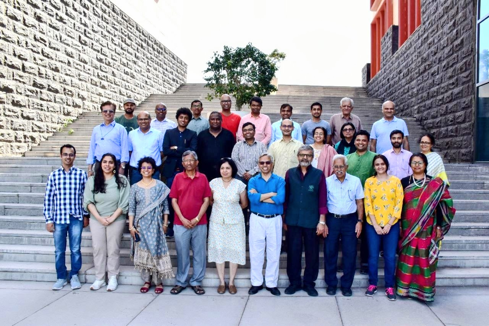

Summary of findings and learnings from the project:

1. Clustering with K-Means: Using the extracted hue and saturation features, the faces were clustered into two distinct groups via the K-Means algorithm.  The resulting clusters, along with their centroids, were visualized in a scatter plot. This visualization helped in understanding how the color features separated the faces into different groups.
2. Face Detection & Clustering: The project effectively used a Haar Cascade classifier to detect faces in the image. This was achieved by converting the input image to grayscale and applying the `detectMultiScale` function, which successfully identified facial regions.

3. Feature Extraction: After detection, each face region was converted from BGR/RGB to HSV color space. The mean hue and saturation values of each face were computed, providing a concise yet informative feature set that reflects the underlying color characteristics of the faces.

4. Using tools like WANDB, github, docker and what are thier purposes and what things the help with.

This project successfully classified faces using distance-based classification and K-Means clustering.

The following is the screenshot from WandB about the weights and biases from the lab code:

input template image:

Data Set Image:

output images are contained in the output folder.